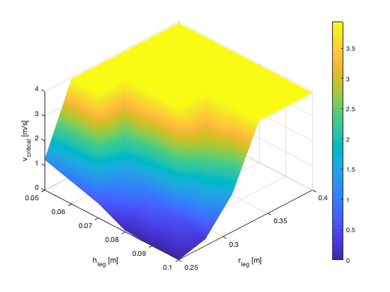
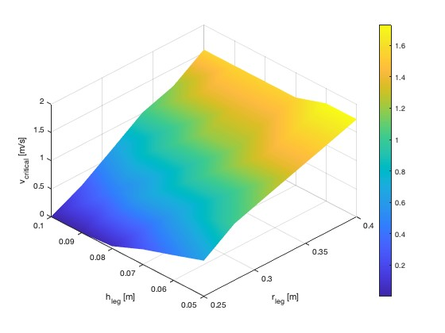

# Training-Wheel-Analysis

This repository contains MATLAB and Simulink models, scripts, and analysis tools for studying the dynamics and control of a **ballbot** equipped with training wheels or similar stabilizing mechanisms.  
It includes dynamic modeling, static analysis, simulations, parameter sweeps, and visualizations.

---

## Folder & File Structure

```
Training-Wheel-Analysis/
├── ballbot.slx                    # Main Simulink model of the ballbot
├── ballbot_isp.slx                # Simulink model with ISP (inverted spring-damper pendulum)
├── rolling_contact_test.slx       # Model testing rolling contact dynamics
├── isdp_test.slx                  # Inverted spring-damper pendulum test model
├── test.slx.r2024b                # Test model
│
├── ballbot_params.m               # Defines base model parameters (e.g., mass, radius, inertia)
├── ballbot_isp_params.m           # Parameters specific to the ISP model
├── rolling_params.m               # Parameters for rolling contact test
├── dynamic.m                      # Script to run dynamic analysis or simulation
├── static.m                       # Script for static equilibrium or stability limits
├── sim_test.m                     # Test simulation script with plotting
├── sim_test_binary.m              # Optimized (binary splitting method) test version
├── phi_max_appr_validation.m      # Validates the maximum tilt angle approximation
│
├── data/                          # .mat files with simulation/experiment data
├── figure/                        # Figures: .fig, .pdf, .jpg
└── video/                         # Example videos: .avi 
```

---

## Key Scripts

| Script                        | Purpose                                                                                     |
|------------------------------|----------------------------------------------------------------------------------------------|
| `ballbot_params.m`           | Defines base model physical & control parameters                                             |
| `ballbot_isp_params.m`       | Parameters specific to the ISP variant                                                       |
| `rolling_params.m`           | Parameters for rolling contact model                                                         |
| `dynamic.m`                  | Runs dynamic simulations or analysis                                                         |
| `static.m`                   | Static equilibrium/stability analysis                                                        |
| `sim_test.m`                 | Runs test simulation and plots results                                                       |
| `sim_test_binary.m`          | Optimized (binary splitting method) version of test                                          |
| `phi_max_appr_validation.m`  | Validates the maximum tilt angle (`phi_max`) approximation                                   |

---

## Example Plots

Example output figures generated from simulations (located in the `figure/` folder):

| Example Figure                                    | Preview |
|--------------------------------------------------|--------:|
| `1s7s_025040510.jpg`                             |  |
| `0s7s_025040510_miu1.jpg`                         |  |

For more detailed plots and contour maps, see `.fig` and `.pdf` files in `figure/`.


